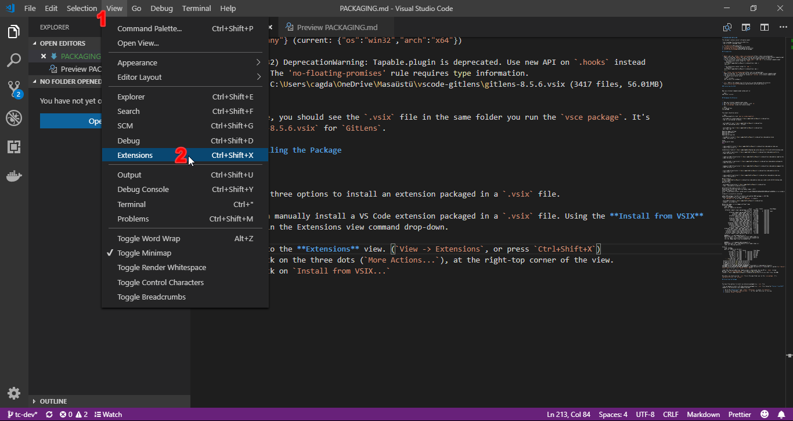
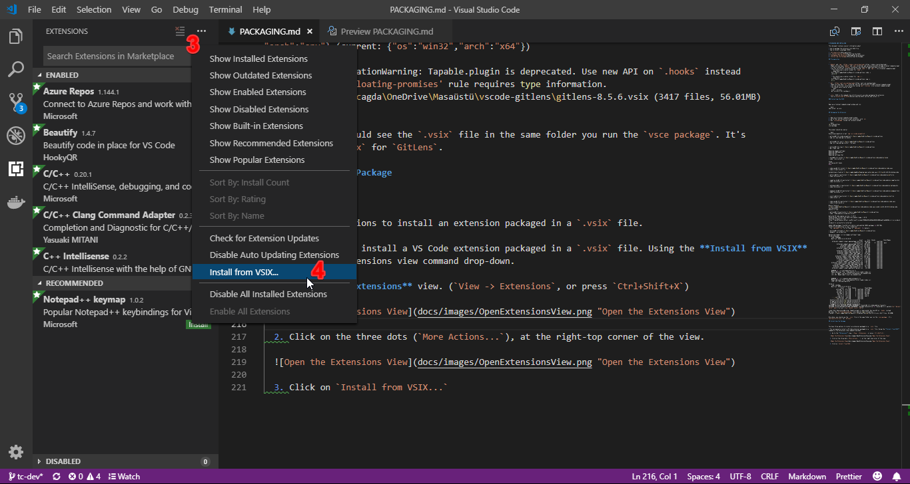
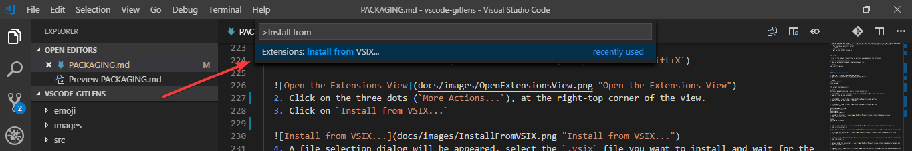

# PACKAGING AND INSTALLING

This document contains overall information about

* how to package the extension into VSIX file
* how to install a package (VSIX)

1. [Prerequisites](#Prerequisites)
    1. [NodeJS and npm](#NodeJS-and-npm)
    2. [Git](#Git)
    3. [vsce](#vsce)
2. [Packaging the Extension](#Packaging-the-Extension)
3. [Installing the Package](#Installing-the-Package)
    1. [With VSCode](#With-VSCode)
        1. [Using the Extensions view](#Using-the-Extensions-view)
        2. [Using the Command Palette](#Using-the-Command-Palette)
    2. [With Command Line](#With-Command-Line)

## Prerequisites

---

### NodeJS and npm

Make sure you have `NodeJS` and `npm` installed, and can be accessible through terminal/command prompt.

* You can download and install `NodeJS` and `npm` from: [https://nodejs.org/en/download/](https://nodejs.org/en/download/)
* If you're using the `GitLens` extension, you should already have done this before.
* You can verify your installations by running `node -v` and `npm -v` in a terminal/command prompt.
  * You should see a similar output for `node -v`:
    ```powershell
    PS C:\Users\cagda\OneDrive\Masaüstü\vscode-gitlens> node -v
    v10.13.0
    ```
  * You should see a similar output for `npm -v`:
    ```powershell
    PS C:\Users\cagda\OneDrive\Masaüstü\vscode-gitlens> npm -v
    6.4.1
    ```
---

### Git

Make sure you have `Git` installed, and can be accessible through terminal/command prompt.

* You can download and install `Git` from: [https://git-scm.com/downloads](https://git-scm.com/downloads)
* You can verify your installation by running `git --version` in a terminal/command prompt.
  * You should see a similar output:
    ```bash
    $ git --version
    git version 2.19.1.windows.1
    ```
---

### vsce

`vsce` is the command line utility we will use when packaging the extension.

* You can install it with `npm`.
* Open up a terminal/command prompt window and run:

```bash
npm install -g vsce
```

---

## Packaging the Extension

1. Open up a terminal/command prompt window.
2. Go to the root directory of your extension, with `cd`.
3. Run `vsce package` inside the terminal window.

```bash
cd vscode-gitlens
vsce package
```

Once done, you should see the `.vsix` file in the same folder you run the `vsce package`. It's `gitlens-extended-8.5.6.vsix` for `GitLens`.

The output should be similar:

```bash
Executing prepublish script 'npm run vscode:prepublish'...

> gitlens@8.5.6 vscode:prepublish C:\Users\cagda\OneDrive\Masaüstü\vscode-gitlens
> npm run reset && npm run bundle


> gitlens@8.5.6 reset C:\Users\cagda\OneDrive\Masaüstü\vscode-gitlens
> npm run clean && npm install --no-save


> gitlens@8.5.6 clean C:\Users\cagda\OneDrive\Masaüstü\vscode-gitlens
> git clean -Xdf

Removing images/settings/
Removing node_modules/
Removing out/
Removing settings.html

> husky@0.14.3 install C:\Users\cagda\OneDrive\Masaüstü\vscode-gitlens\node_modules\husky
> node ./bin/install.js

husky
setting up Git hooks
done


> node-sass@4.9.3 install C:\Users\cagda\OneDrive\Masaüstü\vscode-gitlens\node_modules\node-sass
> node scripts/install.js

Cached binary found at C:\Users\cagda\AppData\Roaming\npm-cache\node-sass\4.9.3\win32-x64-64_binding.node

> gifsicle@3.0.4 postinstall C:\Users\cagda\OneDrive\Masaüstü\vscode-gitlens\node_modules\gifsicle
> node lib/install.js


> jpegtran-bin@3.2.0 postinstall C:\Users\cagda\OneDrive\Masaüstü\vscode-gitlens\node_modules\jpegtran-bin
> node lib/install.js


> optipng-bin@3.1.4 postinstall C:\Users\cagda\OneDrive\Masaüstü\vscode-gitlens\node_modules\optipng-bin
> node lib/install.js


> pngquant-bin@5.0.0 postinstall C:\Users\cagda\OneDrive\Masaüstü\vscode-gitlens\node_modules\pngquant-bin
> node lib/install.js


> electron@3.0.8 postinstall C:\Users\cagda\OneDrive\Masaüstü\vscode-gitlens\node_modules\electron
> node install.js


> node-sass@4.9.3 postinstall C:\Users\cagda\OneDrive\Masaüstü\vscode-gitlens\node_modules\node-sass
> node scripts/build.js

Binary found at C:\Users\cagda\OneDrive\Masaüstü\vscode-gitlens\node_modules\node-sass\vendor\win32-x64-64\binding.node
Testing binary
Binary is fine

> gitlens@8.5.6 postinstall C:\Users\cagda\OneDrive\Masaüstü\vscode-gitlens
> node ./node_modules/vscode/bin/install

Detected VS Code engine version: ^1.25.0
Found minimal version that qualifies engine range: 1.25.0
Fetching vscode.d.ts from: https://raw.githubusercontent.com/Microsoft/vscode/0f080e5267e829de46638128001aeb7ca2d6d50e/src/vs/vscode.d.ts
vscode.d.ts successfully installed!

added 1306 packages from 918 contributors and audited 18833 packages in 259.788s
found 8 vulnerabilities (1 low, 7 moderate)
  run `npm audit fix` to fix them, or `npm audit` for details

> gitlens@8.5.6 bundle C:\Users\cagda\OneDrive\Masaüstü\vscode-gitlens
> webpack --env.production

Optimizing images (src/ui/images/settings/*.png)...
Child extension:
    Time: 138650ms
    Built at: 2018-12-12 19:18:49
                                              Asset       Size  Chunks            Chunk Names
     bitbucket-comment-viewer-app/package-lock.json   96 bytes          [emitted]
                                       extension.js    393 KiB       0  [emitted]  main
            bitbucket-comment-app/package-lock.json   89 bytes          [emitted]
                  bitbucket-comment-app/renderer.js  172 bytes          [emitted]
                 bitbucket-comment-app/package.json  213 bytes          [emitted]
            bitbucket-comment-app/simplemde.min.css   10.7 KiB          [emitted]
                      bitbucket-comment-app/main.js   5.64 KiB          [emitted]
            bitbucket-comment-app/bootstrap.min.css    141 KiB          [emitted]
             bitbucket-comment-app/simplemde.min.js    263 KiB          [emitted]
             bitbucket-comment-viewer-app/logger.js   54 bytes          [emitted]
                   bitbucket-comment-app/index.html   2.27 KiB          [emitted]
          bitbucket-comment-viewer-app/package.json  216 bytes          [emitted]
           bitbucket-comment-viewer-app/renderer.js  172 bytes          [emitted]
            bitbucket-comment-viewer-app/index.html   5.64 KiB          [emitted]
               bitbucket-comment-viewer-app/main.js   5.15 KiB          [emitted]
            bitbucket-comment-viewer-app/styles.css   4.03 KiB          [emitted]
    bitbucket-comment-viewer-app/images/default.png   1.97 KiB          [emitted]
         bitbucket-comment-viewer-app/images/bg.png     17 KiB          [emitted]
      bitbucket-comment-viewer-app/bootstrap.min.js   47.8 KiB          [emitted]
       bitbucket-comment-viewer-app/showdown.min.js   79.1 KiB          [emitted]
     bitbucket-comment-viewer-app/bootstrap.min.css    141 KiB          [emitted]

    WARNING in ./src/gitCommentService.ts
    Module Warning (from ./node_modules/tslint-loader/index.js):
    [13, 1]: Import sources within a group must be alphabetized.
    [13, 10]: Named imports must be alphabetized.


    WARNING in ./src/commands/addLineComments.ts
    Module Warning (from ./node_modules/tslint-loader/index.js):
    [165, 44]: Missing semicolon

Child ui:
    Time: 191590ms
    Built at: 2018-12-12 19:19:42
                  Asset      Size  Chunks             Chunk Names
           settings.css  25.1 KiB       0  [emitted]  settings
            settings.js  11.5 KiB       0  [emitted]  settings
            welcome.css  25.1 KiB       1  [emitted]  welcome
             welcome.js  10.4 KiB       1  [emitted]  welcome
             search.css  25.1 KiB       2  [emitted]  search
              search.js  17.5 KiB       2  [emitted]  search
    ..\..\settings.html   152 KiB          [emitted]
      ..\..\search.html  48.7 KiB          [emitted]
  √ gifsicle pre-build test passed successfully
  √ jpegtran pre-build test passed successfully
  √ optipng pre-build test passed successfully
  √ pngquant pre-build test passed successfully
npm WARN optional SKIPPING OPTIONAL DEPENDENCY: fsevents@1.2.4 (node_modules\fsevents):
npm WARN notsup SKIPPING OPTIONAL DEPENDENCY: Unsupported platform for fsevents@1.2.4: wanted {"os":"darwin","arch":"any"} (current: {"os":"win32","arch":"x64"})

(node:7432) DeprecationWarning: Tapable.plugin is deprecated. Use new API on `.hooks` instead
Warning: The 'no-floating-promises' rule requires type information.
Created: C:\Users\cagda\OneDrive\Masaüstü\vscode-gitlens\gitlens-8.5.6.vsix (3417 files, 56.01MB)
```

---

## Installing the Package

You have three options to install an extension packaged in a `.vsix` file. You can manually install a VS Code extension packaged in a `.vsix` file

### With VSCode

#### Using the Extensions view

1. Go to the **Extensions** view. (`View -> Extensions`, or press `Ctrl+Shift+X`)
2. Click on the three dots (`More Actions...`), at the right-top corner of the view.
3. Click on `Install from VSIX...`
4. A file selection dialog will be appeared, select the `.vsix` file you want to install and wait for the installation to complete.





#### Using the Command Palette

1. Open the Command Palette. (`View -> Command Palette...`, or press `Ctrl+Shift+P`)
2. Search for the **Install from VSIX** keyword and select the **Extensions: Install from VSIX** command.
3. A file selection dialog will be appeared, select the `.vsix` file you want to install and wait for the installation to complete.



### With Command Line

You can also install using the VS Code `--install-extension` command line switch providing the path to the `.vsix` file.

1. Open up a terminal/command prompt window.
2. Run:

```bash
code --install-extension <path-to-the-vsix>.vsix
```

---